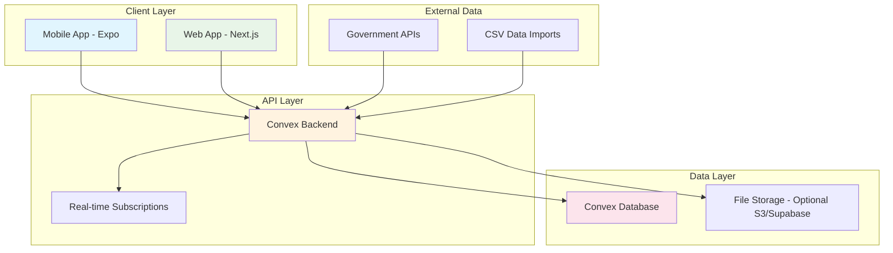
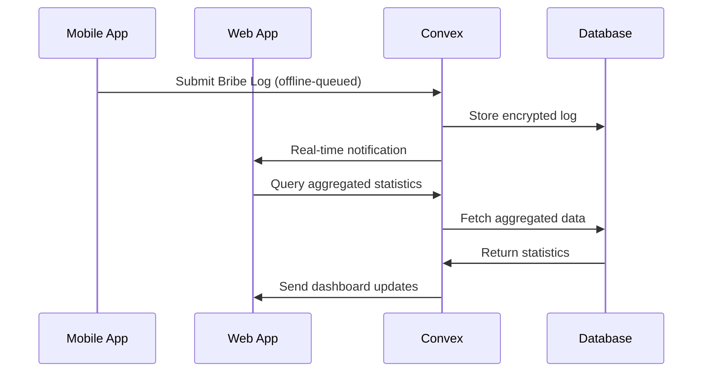

# CivicLens - Unified Anti-Corruption Platform Design

## Overview

CivicLens is a comprehensive anti-corruption platform that provides transparency tools for citizens, activists, and civil society organizations. The platform combines six core modules to detect corruption patterns, track government processes, and enable citizen participation in governance oversight.

**Tagline**: "Transparency in your pocket"

**Target Users**: 
- Citizens seeking government services
- Journalists and researchers
- Anti-corruption activists
- Civil society organizations
- Government transparency advocates

**Core Value Proposition**:
- Real-time corruption risk detection
- Citizen-powered data collection
- Transparent government process tracking
- Evidence-based advocacy tools

## Technology Stack & Dependencies

### Frontend Applications
- **Mobile**: Expo React Native (iOS + Android) with NativeWind + Reanimated/Moti
- **Web**: Next.js with Tailwind CSS + Shadcn UI components

### Backend & Data
- **Backend**: Convex (serverless functions, real-time data, authentication)
- **Database**: Convex for structured data
- **Storage**: Optional Supabase/S3 for file uploads
- **Authentication**: Convex auth with magic link/email OTP

### Development Tools
- **Monorepo**: Turborepo for build orchestration
- **Package Manager**: Bun v1.2.12
- **Linting**: Biome for code formatting
- **TypeScript**: Full-stack type safety

### Additional Libraries
- **PDF Generation**: react-pdf / pdfkit (client-side)
- **Internationalization**: react-i18next (Bangla/English)
- **Animations**: Framer Motion (web), Moti/Reanimated (mobile)
- **Charts**: Recharts for data visualization

## Component Architecture

### Mobile App Component Hierarchy

```
MobileApp/
├── Navigation/
│   ├── TabNavigator (bottom tabs)
│   ├── DrawerNavigator (side menu)
│   └── StackNavigator (screen transitions)
├── Screens/
│   ├── ProcurementScreens/
│   │   ├── TenderListScreen
│   │   ├── TenderDetailScreen
│   │   ├── TenderSearchScreen
│   │   └── RiskReportScreen
│   ├── ServicesScreens/
│   │   ├── FeeCheckScreen
│   │   ├── BribeLogScreen
│   │   ├── PermitTrackerScreen
│   │   └── ServiceCatalogScreen
│   ├── RTIScreens/
│   │   ├── RTIWizardScreen
│   │   ├── RequestTrackerScreen
│   │   └── OutcomeRepositoryScreen
│   ├── BudgetScreens/
│   │   ├── ProjectExplorerScreen
│   │   ├── BudgetComparisonScreen
│   │   └── CrowdVerificationScreen
│   └── ProfileScreens/
│       ├── UserProfileScreen
│       ├── SettingsScreen
│       └── LanguageToggleScreen
├── Components/
│   ├── UI/
│   │   ├── Card (rounded-2xl, soft shadows)
│   │   ├── Button (animated, vibrant colors)
│   │   ├── Input (bilingual support)
│   │   ├── Badge (risk indicators)
│   │   └── Modal (animated transitions)
│   ├── Forms/
│   │   ├── RTIRequestForm
│   │   ├── BribeLogForm
│   │   ├── FeeReportForm
│   │   └── PermitApplicationForm
│   ├── Charts/
│   │   ├── RiskScoreChart
│   │   ├── DelayHeatmap
│   │   ├── BudgetComparisonChart
│   │   └── TimelineChart
│   └── Common/
│       ├── LanguageToggle
│       ├── LoadingSpinner
│       ├── ErrorBoundary
│       └── OfflineIndicator
└── Utils/
    ├── i18n (language management)
    ├── convex (API client)
    ├── storage (offline data)
    └── crypto (hash generation)
```

### Web App Component Architecture

```
WebApp/
├── Pages/
│   ├── Dashboard/
│   │   ├── OverviewPage
│   │   ├── ProcurementDashboard
│   │   ├── ServicesDashboard
│   │   └── BudgetDashboard
│   ├── Public/
│   │   ├── TenderExplorer
│   │   ├── ServiceCatalog
│   │   ├── RTIRepository
│   │   └── BudgetTransparency
│   └── Admin/
│       ├── DataImportPage
│       ├── UserManagementPage
│       └── SystemConfigPage
├── Components/
│   ├── Dashboard/
│   │   ├── MetricsCard
│   │   ├── TrendChart
│   │   ├── DataTable
│   │   └── FilterPanel
│   ├── Visualization/
│   │   ├── RiskScoreVisualization
│   │   ├── GeographicHeatmap
│   │   ├── TimelineVisualization
│   │   └── BudgetFlowChart
│   ├── Export/
│   │   ├── PDFExporter
│   │   ├── CSVExporter
│   │   └── DatasetDownloader
│   └── Common/
│       ├── Header
│       ├── Navigation
│       ├── Footer
│       └── LanguageSelector
└── Layouts/
    ├── DashboardLayout
    ├── PublicLayout
    └── AdminLayout
```

## Data Flow Between Layers

### Architecture Overview



### Data Synchronization Flow

1. **Mobile-First Design**: Mobile app supports offline-first with local SQLite storage
2. **Real-time Updates**: Convex provides real-time subscriptions for live data updates
3. **Conflict Resolution**: Last-write-wins with timestamp-based conflict resolution
4. **Batch Sync**: Queued operations sync when connectivity is restored

### API Integration Patterns



## Core Modules Architecture

### 1. ProcureLens - Procurement Risk Detection

**Data Models**:
```typescript
interface Tender {
  id: string;
  buyer: string;
  sector: string;
  method: string;
  publishDate: Date;
  closeDate: Date;
  awardDate?: Date;
  estimatedAmount: number;
  awardAmount?: number;
  biddersCount: number;
  winner?: string;
  flags: RiskFlag[];
  riskScore: number;
}

interface Supplier {
  id: string;
  name: string;
  totalAwards: number;
  lastAwardDate: Date;
  winRate: number;
  averageMargin: number;
}

enum RiskFlag {
  SINGLE_BIDDER = "single_bidder",
  SHORT_WINDOW = "short_window", 
  REPEAT_WINNER = "repeat_winner",
  HIGH_MARGIN = "high_margin",
  QUICK_AWARD = "quick_award"
}
```

**Risk Scoring Algorithm**:
- Single Bidder: +40 points
- Bidding window < 14 days: +25 points
- Same winner >3 consecutive times: +30 points
- Award amount >20% above estimate: +35 points
- Award within 48 hours of closing: +20 points

**Mobile Components**:
- TenderListCard (search, filter, sort)
- TenderDetailView (timeline, flags, supplier history)
- RiskScoreIndicator (color-coded badges)
- PDFExportButton (risk brief generation)

### 2. FeeCheck - Service Overcharge Detection

**Data Models**:
```typescript
interface Service {
  id: string;
  name: string;
  nameLocal: string; // Bangla translation
  officeType: string;
  officialFee: number;
  officialTimeline: number; // days
  legalReference: string;
  category: ServiceCategory;
}

interface OverchargeReport {
  id: string;
  serviceId: string;
  reportedFee: number;
  timestamp: Date;
  location?: GeoLocation;
  note?: string;
  isAnonymous: boolean;
}

enum ServiceCategory {
  CIVIL_DOCUMENTS = "civil_documents",
  BUSINESS_PERMITS = "business_permits",
  LAND_SERVICES = "land_services",
  TAX_SERVICES = "tax_services"
}
```

**Overcharge Detection Logic**:
- Compare reported fee vs official fee
- Flag if >10% above official rate
- Generate location-based heatmaps
- Track repeat offending offices

**Mobile Components**:
- ServiceSearchBar (autocomplete, bilingual)
- FeeComparisonCard (official vs reported)
- OverchargeHeatmap (geographic visualization)
- QuickReportButton (one-tap logging)

### 3. RTI Copilot - Right to Information Assistant

**Data Models**:
```typescript
interface RTIRequest {
  id: string;
  userId: string;
  agency: string;
  topic: string;
  requestText: string;
  status: RTIStatus;
  submissionDate: Date;
  deadline: Date;
  responseDate?: Date;
  outcome?: string;
  isPublished: boolean;
}

enum RTIStatus {
  DRAFT = "draft",
  SUBMITTED = "submitted", 
  UNDER_REVIEW = "under_review",
  RESPONDED = "responded",
  APPEALED = "appealed",
  OVERDUE = "overdue"
}
```

**Request Generation Wizard**:
1. Agency Selection (dropdown with search)
2. Topic Categories (predefined templates)
3. Custom Information Request
4. Legal Formatting (auto-generated)
5. Submission Tracking

**Mobile Components**:
- AgencyPicker (searchable dropdown)
- TopicWizard (step-by-step form)
- DeadlineTracker (countdown timer)
- OutcomePublisher (anonymized sharing)

### 4. FairLine - Bribe Solicitation Logger

**Data Models**:
```typescript
interface BribeLog {
  id: string;
  timestamp: Date;
  office: string;
  service: string;
  amount?: number;
  audioUrl?: string;
  textNote?: string;
  location?: GeoLocation;
  hash: string; // tamper evidence
  previousHash?: string; // blockchain-style chaining
}
```

**Hash Chain Implementation**:
```typescript
function generateLogHash(log: BribeLog, previousHash?: string): string {
  const data = `${log.timestamp}|${log.office}|${log.service}|${previousHash || ''}`;
  return sha256(data);
}
```

**Mobile Components**:
- QuickLogButton (floating action button)
- VoiceRecorder (encrypted audio notes)
- LocationPicker (optional geo-tagging)
- EvidenceExporter (CSV/PDF bundles)

### 5. PermitPath - Delay Detection System

**Data Models**:
```typescript
interface PermitApplication {
  id: string;
  serviceId: string;
  userId: string;
  office: string;
  appliedDate: Date;
  expectedDays: number;
  currentStatus: PermitStatus;
  actualDays?: number;
  isDelayed: boolean;
  escalationLetterGenerated?: boolean;
}

enum PermitStatus {
  APPLIED = "applied",
  UNDER_REVIEW = "under_review", 
  ADDITIONAL_DOCS = "additional_docs",
  APPROVED = "approved",
  REJECTED = "rejected",
  ESCALATED = "escalated"
}
```

**Delay Detection Logic**:
- Compare actual days vs expected timeline
- Statistical analysis against crowd averages
- Alert when >150% of expected time
- Generate escalation letter templates

**Mobile Components**:
- ApplicationTracker (timeline view)
- DelayAlert (push notifications)
- EscalationGenerator (template letters)
- StatusUpdater (manual progress tracking)

### 6. WardWallet - Budget Transparency

**Data Models**:
```typescript
interface Project {
  id: string;
  ward: string;
  name: string;
  nameLocal: string;
  plannedBudget: number;
  actualSpend: number;
  unitCost: number;
  unitType: string; // per km, per sq ft, etc.
  photos: ProjectPhoto[];
  status: ProjectStatus;
  startDate: Date;
  completionDate?: Date;
}

interface ProjectPhoto {
  id: string;
  url: string;
  location: GeoLocation;
  timestamp: Date;
  userId: string;
  verificationStatus: PhotoVerificationStatus;
}

enum PhotoVerificationStatus {
  PENDING = "pending",
  VERIFIED = "verified",
  DISPUTED = "disputed"
}
```

**Unit Cost Analysis**:
- Compare costs against regional benchmarks
- Flag projects >30% above average unit cost
- Crowd-sourced verification through photos
- Progress tracking through geo-tagged images

**Mobile Components**:
- ProjectExplorer (map view, list view)
- BudgetComparison (planned vs actual charts)
- PhotoVerification (camera integration)
- CostAnalyzer (unit cost comparisons)

## Routing & Navigation

### Mobile App Navigation Structure

```
TabNavigator (Bottom Tabs):
├── 🏛 Procurement
│   ├── TenderList (Stack)
│   ├── TenderDetail (Stack)
│   ├── TenderSearch (Stack)
│   └── RiskReport (Stack)
├── 💵 Services
│   ├── ServiceTabs (Top Tabs)
│   │   ├── FeeCheck
│   │   ├── BribeLog
│   │   └── PermitTracker
├── 📜 RTI
│   ├── RequestWizard (Stack)
│   ├── RequestTracker (Stack)
│   └── OutcomeRepository (Stack)
├── 📊 Budgets
│   ├── ProjectExplorer (Stack)
│   ├── BudgetComparison (Stack)
│   └── PhotoVerification (Stack)
└── 👤 Profile
    ├── UserProfile (Stack)
    ├── Settings (Stack)
    └── About (Stack)
```

### Web App Routing Structure

```
/dashboard
  /procurement
  /services  
  /rti
  /budgets
/public
  /tenders
  /services
  /budgets
  /rti-outcomes
/admin
  /data-import
  /user-management
  /system-config
/api
  /export/[format]
  /data/[collection]
```

## Styling Strategy

### Design System Specifications

**Color Palette**:
- Primary: Teal (#0891b2)
- Secondary: Orange (#ea580c) 
- Accent: Violet (#7c3aed)
- Success: Lime (#65a30d)
- Warning: Amber (#d97706)
- Error: Red (#dc2626)

**Typography Scale**:
- Headings: Inter Bold (mobile), Poppins Bold (web)
- Body: Inter Regular
- Code: JetBrains Mono

**Spacing System**: 
- Base unit: 4px
- Scale: 4, 8, 12, 16, 24, 32, 48, 64px

**Component Styling**:
- Border Radius: rounded-2xl (16px) everywhere
- Shadows: Soft shadows with blur
- Animations: 200ms ease transitions
- Cards: Elevated with hover/tap bounce effects

### Mobile Styling (NativeWind + Tailwind)

```typescript
// Component style examples
const cardStyle = "bg-white rounded-2xl p-6 shadow-lg shadow-gray-200/50";
const buttonStyle = "bg-teal-500 rounded-2xl px-6 py-4 active:scale-95 transition-transform";
const badgeStyle = "bg-orange-100 text-orange-800 px-3 py-1 rounded-full text-sm font-medium";
```

### Web Styling (Tailwind + Shadcn)

```typescript
// Shadcn component variants
const cardVariants = cva("rounded-2xl border bg-card text-card-foreground shadow-sm");
const buttonVariants = cva("rounded-2xl font-medium transition-all", {
  variants: {
    variant: {
      default: "bg-teal-500 text-white hover:bg-teal-600",
      outline: "border border-teal-500 text-teal-500 hover:bg-teal-50"
    }
  }
});
```

## State Management

### Convex Real-time State Management

**Query Patterns**:
```typescript
// Real-time tender data
const tenders = useQuery(api.tenders.list, { 
  sector: "infrastructure",
  riskScore: { $gte: 50 } 
});

// User's RTI requests with live updates
const userRTIRequests = useQuery(api.rti.getUserRequests, {
  userId: user.id,
  status: "submitted"
});

// Aggregated overcharge statistics
const overchargeStats = useQuery(api.services.getOverchargeStats, {
  timeRange: "last_30_days",
  location: userLocation
});
```

**Mutation Patterns**:
```typescript
// Submit bribe log with offline support
const logBribe = useMutation(api.bribeLogs.create);
const submitLog = async (logData) => {
  try {
    await logBribe(logData);
  } catch (error) {
    // Queue for offline sync
    await queueOfflineAction('logBribe', logData);
  }
};

// Update permit application status
const updatePermitStatus = useMutation(api.permits.updateStatus);
```

### Mobile State Management

**Local Storage Strategy**:
- SQLite for offline data persistence
- Expo SecureStore for sensitive data
- AsyncStorage for user preferences
- Image cache for downloaded content

**Offline-First Architecture**:
```typescript
interface OfflineQueue {
  id: string;
  action: string;
  data: any;
  timestamp: Date;
  retryCount: number;
}

// Offline sync service
class OfflineSyncService {
  async queueAction(action: string, data: any) {
    await SQLite.insertOfflineAction({ action, data, timestamp: new Date() });
  }
  
  async syncPendingActions() {
    const pendingActions = await SQLite.getPendingActions();
    for (const action of pendingActions) {
      try {
        await this.executeAction(action);
        await SQLite.markActionSynced(action.id);
      } catch (error) {
        await SQLite.incrementRetryCount(action.id);
      }
    }
  }
}
```

## Internationalization (i18n)

### Language Support Structure

**Supported Languages**:
- English (en) - Primary
- Bangla (bn) - Secondary

**Translation File Structure**:
```
locales/
├── en/
│   ├── common.json (navigation, buttons, labels)
│   ├── procurement.json (tender-related terms)
│   ├── services.json (government service names)
│   ├── rti.json (RTI-specific terminology)
│   └── validation.json (form validation messages)
└── bn/
    ├── common.json
    ├── procurement.json
    ├── services.json
    ├── rti.json
    └── validation.json
```

**Key Translation Examples**:
```json
{
  "en": {
    "tender": "Tender",
    "risk_score": "Risk Score", 
    "overcharge_detected": "Overcharge Detected",
    "file_rti_request": "File RTI Request"
  },
  "bn": {
    "tender": "দরপত্র",
    "risk_score": "ঝুঁকির স্কোর",
    "overcharge_detected": "অতিরিক্ত ফি সনাক্ত",
    "file_rti_request": "তথ্য অধিকার আবেদন"
  }
}
```

**Implementation Pattern**:
```typescript
// React Native
import { useTranslation } from 'react-i18next';

const TenderCard = ({ tender }) => {
  const { t } = useTranslation('procurement');
  return (
    <Card>
      <Text>{t('tender')}: {tender.title}</Text>
      <Badge>{t('risk_score')}: {tender.riskScore}</Badge>
    </Card>
  );
};

// Language toggle component
const LanguageToggle = () => {
  const { i18n } = useTranslation();
  const toggleLanguage = () => {
    i18n.changeLanguage(i18n.language === 'en' ? 'bn' : 'en');
  };
  
  return (
    <Button onPress={toggleLanguage}>
      {i18n.language === 'en' ? 'বাংলা' : 'English'}
    </Button>
  );
};
```

## Security & Privacy

### Data Protection Strategy

**Anonymous Mode**:
- Random UUID generation for anonymous users
- No email/phone collection in anonymous mode
- Local-only data storage option
- Automatic PII redaction before data export

**Encryption Implementation**:
```typescript
// Bribe log encryption
class BribeLogCrypto {
  static async encryptSensitiveData(data: BribeLog): Promise<EncryptedBribeLog> {
    const key = await generateEncryptionKey();
    const encryptedNote = await encrypt(data.textNote, key);
    const encryptedAudio = data.audioUrl ? await encryptFile(data.audioUrl, key) : null;
    
    return {
      ...data,
      textNote: encryptedNote,
      audioUrl: encryptedAudio,
      encryptionKeyId: key.id
    };
  }
  
  static generateTamperProofHash(log: BribeLog, previousHash?: string): string {
    const payload = `${log.timestamp}|${log.office}|${log.service}|${previousHash || ''}`;
    return sha256(payload);
  }
}
```

**Privacy Controls**:
- Granular data sharing permissions
- Automatic location data anonymization (grid-based)
- Option to exclude sensitive fields from exports
- Automatic deletion of old data (user configurable)

### Authentication & Authorization

**User Roles**:
- Anonymous User (limited read access)
- Registered Citizen (full mobile features)
- Verified Journalist (additional export permissions)
- Organization Admin (bulk data management)
- System Admin (user management, system config)

**Convex Auth Integration**:
```typescript
// Authentication configuration
export const authConfig = {
  providers: [
    {
      domain: "CivicLens",
      applicationID: "convex",
      customClaims: {
        role: "citizen",
        verificationStatus: "unverified",
        anonymousMode: true
      }
    }
  ]
};

// Role-based access control
export const requireRole = (role: UserRole) => {
  return (ctx: QueryCtx | MutationCtx) => {
    const identity = ctx.auth.getUserIdentity();
    if (!identity || identity.role !== role) {
      throw new Error("Unauthorized");
    }
    return identity;
  };
};
```

## Testing Strategy

### Unit Testing Framework

**Mobile Testing (Jest + React Native Testing Library)**:
```typescript
// Component testing example
describe('TenderCard', () => {
  test('displays risk score with correct color coding', () => {
    const tender = { id: '1', riskScore: 75, title: 'Road Construction' };
    render(<TenderCard tender={tender} />);
    
    expect(screen.getByText('Risk Score: 75')).toBeVisible();
    expect(screen.getByTestId('risk-badge')).toHaveStyle({ backgroundColor: '#dc2626' });
  });
  
  test('handles bilingual content correctly', () => {
    const { rerender } = render(<TenderCard tender={mockTender} />);
    expect(screen.getByText('Tender')).toBeVisible();
    
    // Switch to Bangla
    i18n.changeLanguage('bn');
    rerender(<TenderCard tender={mockTender} />);
    expect(screen.getByText('দরপত্র')).toBeVisible();
  });
});
```

**Web Testing (Jest + React Testing Library)**:
```typescript
// Dashboard testing
describe('ProcurementDashboard', () => {
  test('filters tenders by risk score', async () => {
    render(<ProcurementDashboard />);
    
    const riskFilter = screen.getByLabelText('Minimum Risk Score');
    fireEvent.change(riskFilter, { target: { value: '50' } });
    
    await waitFor(() => {
      expect(screen.getAllByTestId('tender-card')).toHaveLength(3);
    });
  });
});
```

**Backend Testing (Convex Testing Framework)**:
```typescript
// Convex function testing
describe('tender mutations', () => {
  test('calculates risk score correctly', async () => {
    const tenderData = {
      biddersCount: 1, // Single bidder
      publishDate: new Date(),
      closeDate: new Date(Date.now() + 7 * 24 * 60 * 60 * 1000), // 7 days
      estimatedAmount: 1000000,
      awardAmount: 1300000 // 30% above estimate
    };
    
    const result = await convex.mutation(api.tenders.create, tenderData);
    expect(result.riskScore).toBe(95); // 40 + 25 + 30 = 95
  });
});
```

### Integration Testing

**E2E Testing (Detox for Mobile)**:
```typescript
describe('Bribe Logging Flow', () => {
  beforeEach(async () => {
    await device.reloadReactNative();
  });

  test('should log bribe incident successfully', async () => {
    await element(by.id('services-tab')).tap();
    await element(by.id('bribe-log-button')).tap();
    
    await element(by.id('office-input')).typeText('Land Office');
    await element(by.id('service-input')).typeText('Mutation Certificate');
    await element(by.id('submit-button')).tap();
    
    await expect(element(by.text('Log saved successfully'))).toBeVisible();
  });
});
```

**API Integration Testing**:
```typescript
describe('Convex API Integration', () => {
  test('real-time updates work correctly', async () => {
    const mockSubscription = jest.fn();
    
    // Subscribe to tender updates
    const unsubscribe = convex.onUpdate(api.tenders.list, {}, mockSubscription);
    
    // Create new tender
    await convex.mutation(api.tenders.create, mockTenderData);
    
    // Verify subscription was called
    await waitFor(() => {
      expect(mockSubscription).toHaveBeenCalledWith(
        expect.arrayContaining([expect.objectContaining({ id: expect.any(String) })])
      );
    });
    
    unsubscribe();
  });
});
```